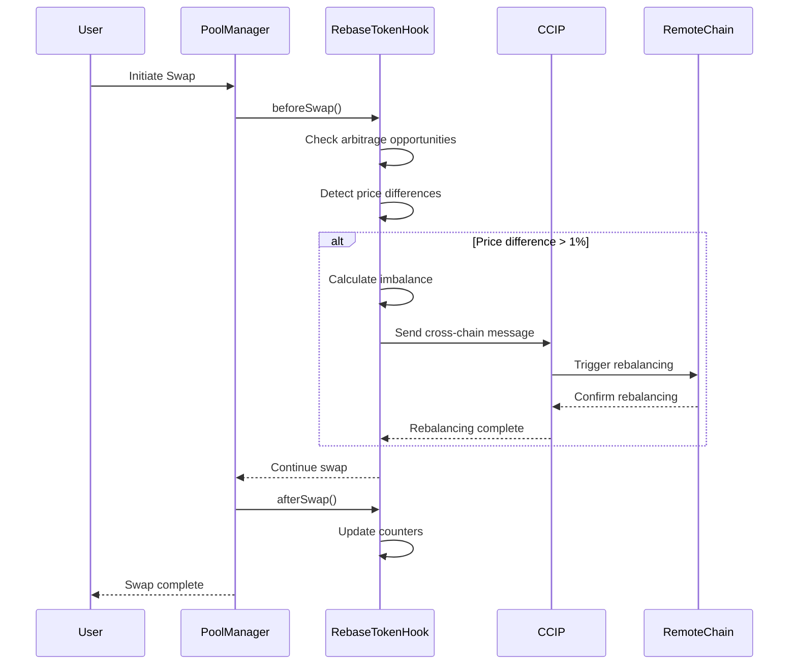

### Summary

This Uniswap V4 hook is about cross-chain liquidity rebalancing and arbitrage benifits. Though the token cross-chain rebasing part is learned and executed from this [repo].(https://github.com/Cyfrin/foundry-cross-chain-rebase-token-cu)

It automatically detects arbitrage opportunities and pool imbalances, then triggers cross-chain rebalancing operations to maintain optimal liquidity efficiency.

### Hook permissions

- **beforeSwap**
- **afterSwap**
- **beforeAddLiquidity**
- **beforeRemoveLiquidity**

### Hook Flow



### Some Thresholds (RANDOMLY CHOOSEN)

| Parameter | Value | Description |
|-----------|--------|-------------|
| Arbitrage Threshold | 1% (100 bp) | Minimum price difference to trigger arbitrage |
| Rebalance Cooldown | 1 hour | Minimum time between rebalancing operations |
| Default Imbalance Threshold | 5% | Default pool imbalance trigger level |
| Max Imbalance Threshold | 10% | Maximum allowed imbalance threshold |
| Price Precision | 18 decimals | Price data precision factor |


### Test

```js
forge test --match-path test/hook-rebase-fixed.t.sol
```